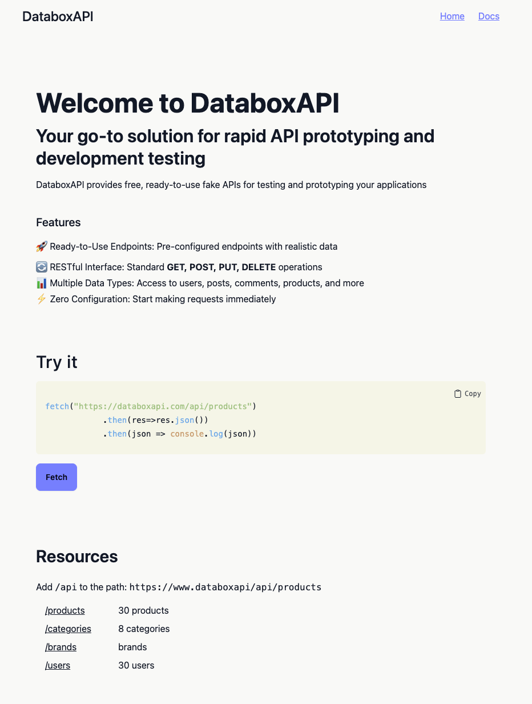
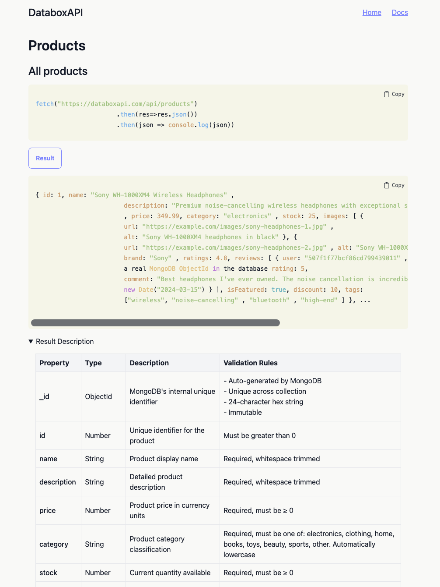

# DataboxAPI

DataboxAPI is a free fake REST API for frontend developers who need realistic data to prototype and test against — without setting up their own backend. Think JSONPlaceholder, but with an e-commerce dataset: products, categories, brands, and users.

All endpoints return real MongoDB documents. Write operations (POST, PUT, PATCH, DELETE) are intentionally simulated — they validate input and return the expected response, but never modify the database, so the dataset stays consistent for everyone.

**Live:** [databoxapi.com](https://databoxapi.com) &nbsp;·&nbsp; **Docs:** [databoxapi.com/docs](https://databoxapi.com/docs)

## Screenshots




## Endpoints

| Resource | URL |
|---|---|
| Products | `GET /api/products` |
| Categories | `GET /api/categories` |
| Brands | `GET /api/brands` |
| Users | `GET /api/users` |

## Products filters

`category` · `brand` · `minPrice` · `maxPrice` · `inStock` · `minDiscount` · `minRating` · `tags` · `sortBy` · `order` · `page` · `limit`

```
GET /api/products?category=electronics&sortBy=price&order=desc&page=1&limit=10
```

## Write operations

POST / PUT / PATCH / DELETE are supported on `/products` and `/users`. They validate input and return the expected response but **do not modify the database**.

## Stack

Node.js · Express · MongoDB Atlas · EJS · Tailwind CSS

## Local setup

```bash
npm run dev
npm run build:css  # watch mode
```

Requires `.env.local` with `MONGODB_URI`.
